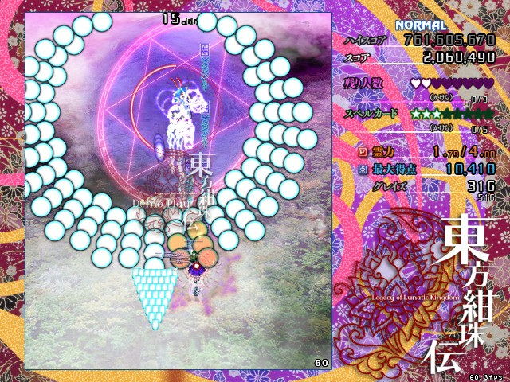
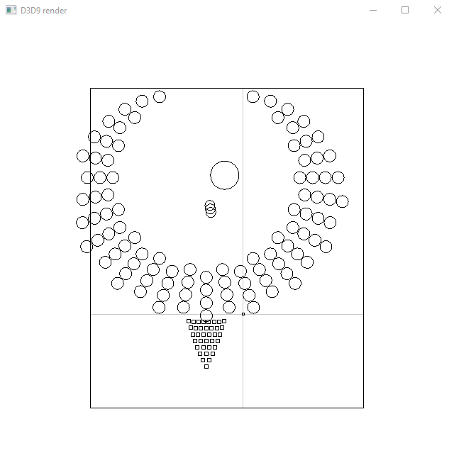

# Wireframe Touhou

Visualize Touhou hit-test.

## Usage

* Launch game
* Run this tool, check (and adjust) detected config, and click OK

## Important Note

This tool will patch game's memory, please backup your save data in case of data loss.

## Screenshot

Note: circle with radius<5px is drawn as box.

## Supported game/version

- TH10: Mountain of Faith (1.00a)
- TH11: Subterranean Animism (1.00a)
- TH12: Undefined Fantastic Object (1.00b)
- TH13: Ten Desires (1.00c)
- TH14: Double Dealing Character (1.00b)
- TH15: Legacy of Lunatic Kingdom (1.00b)
- TH16: Hidden Star in Four Seasons (1.00a)
